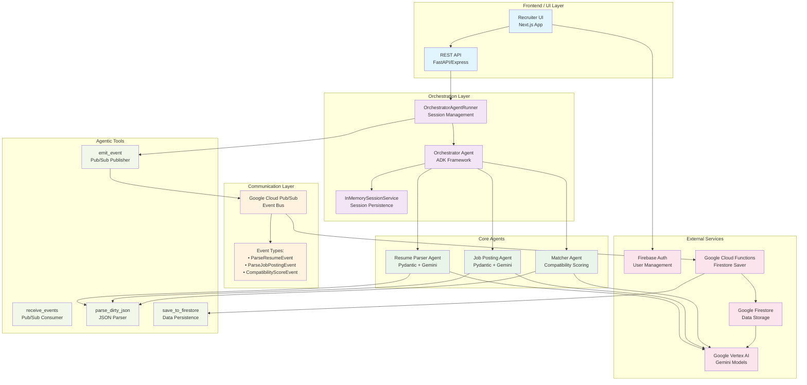
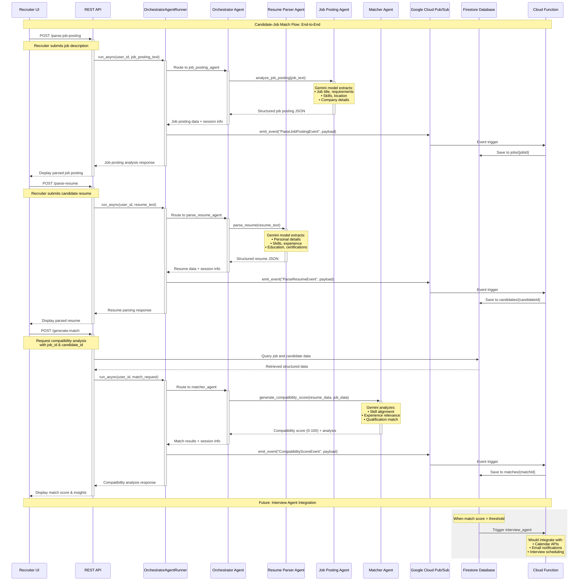

# Co-Agent-Recruitment Hire — Agent-to-Agent AI Recruitment Platform


## Executive Summary

Co-Agent-Recruitment Hire automates the end-to-end recruitment workflow by orchestrating specialized AI agents to parse resumes, analyze job postings, and deliver data-driven match recommendations—all while safeguarding candidate privacy. Recruiters only ever see anonymized, non-PII summaries and high-level insights; our co-agents handle personal data with the utmost care.
Built on Google’s Agent Development Kit (ADK) and leveraging event-driven agent-to-agent communication, Co-Agent-Recruitment Hire provides a scalable, modular architecture for streamlined and privacy-first hiring operations.

## Motivation

Hiring teams face several challenges:
- Manual extraction of unstructured resume and job posting data.
- Lack of real-time, structured insights for candidate–job alignment.
- Scalability bottlenecks when handling high volumes of applications.

Co-Agent-Recruitment Hire addresses these pain points by automating parsing, matching, and session management to accelerate and scale the recruitment process.

## Solution Overview

| Pillar                         | Description                                                          |
|--------------------------------|----------------------------------------------------------------------|
| **ADK Framework**              | Defines and configures AI agents for discrete parsing and matching tasks. |
| **Agent-to-Agent (Co-Agent-Recruitment)**       | Agents coordinate via Pub/Sub events and sub-agent orchestration.    |
| **Core Agents**                | Resume Parser, Job Posting Parser, Matcher, and Orchestrator.       |
| **Dataflow & Scalability**     | Stateless agents with Pub/Sub messaging, containerized for elastic scaling. |


## Architecture Overview

```text
   +----------+          +-------------+        +------------+
   | Company  |          | Resume      |        | Job Posting|
   | & Candidate|---+--->| Parser      |        | Parser     |
   +----------+   |      +-------------+        +------------+
                  |              \                /
                  |               \              /
                  |           +----------------------+      +--------+
                  +---------->| Orchestrator Agent   |----->| Matcher|
                              +----------------------+      +--------+
                                                  |
                                                  v
                                          +---------------+
                                          | UI & Reporting|
                                          +---------------+
```

## Agent Development Kit (ADK) Framework

Agents and orchestration are defined using Google’s ADK, which provides session management, callbacks, and modular sub-agent support.【F:co_agent_recruitment/agent.py†L99-L123】

The `OrchestratorAgentRunner` wraps the orchestrator for programmatic use and integrates session handling and event publishing.【F:co_agent_recruitment/agent_engine.py†L31-L44】

## Agent-to-Agent Communication (Co-Agent-Recruitment)

Agents emit and consume events via Google Cloud Pub/Sub using helper tools for robust message handling. This decouples services and enables asynchronous coordination.【F:co_agent_recruitment/tools/pubsub.py†L146-L168】【F:co_agent_recruitment/tools/pubsub.py†L171-L183】

## Core Features

Outlined in the project [blueprint](docs/blueprint.md):【F:docs/blueprint.md†L5-L9】
- **Company Interface:** Structured submission of job descriptions.
- **Candidate Interface:** Structured submission of resumes.
- **AI Matchmaking:** Orchestrator agent compares and matches profiles using Gemini via ADK.
- **Match Display:** Ranked match recommendations for both companies and candidates.
- **Privacy-First Workflow:** Recruiters only ever see anonymized summaries and high-level insights; all PII remains securely managed by our cooperative agents.

## Dataflow & Scalability Management

1. **Ingestion:** Resumes and job postings are submitted via REST or events.
2. **Parsing:** Dedicated agents transform unstructured text into JSON structures.
3. **Orchestration:** A master agent routes parsed data, invokes matching, and enriches responses with session info.
4. **Matching:** Compatibility scores are generated through a matcher agent.
5. **Emission:** Results are published to Pub/Sub, stored, and surfaced in the UI.

All components are stateless and containerized for horizontal scaling. Pub/Sub ensures backpressure management and elasticity under load.




## Event Flow



## Getting Started

1. Clone the repository and navigate into the project root.
2. Copy environment templates and set required variables:
   ```bash
   cp .env.example .env.local
   ```
3. Start dependencies (Pub/Sub emulator, Qdrant, etc.) via Docker Compose:
   ```bash
   docker-compose up -d
   ```
4. Launch the API server:
   ```bash
   uvicorn standalone_server:app --reload
   ```
5. Install dependencies and start the NextJS frontend:
   ```bash
   bun install
   bun run dev
   ```
6. Open the UI at http://localhost:9002 and follow on-screen prompts.

## Debugging

A VS Code launch configuration has been added at `.vscode/launch.json`:

- **Debug TypeScript File**: runs and debugs the currently open `.ts` file using `ts-node`.
- **Debug JavaScript File**: runs and debugs the currently open `.js` file with Node.

Make sure to install `ts-node` as a development dependency:
```bash
npm install --save-dev ts-node
```

Select the desired configuration from the Run and Debug panel in VS Code.

## Project Structure

```
. 
├── co_agent_recruitment/          # Core ADK agents & API
├── docs/                         # Design blueprints and diagrams
├── standalone_server.py          # Lightweight JSON-focused API
├── compose.yaml                  # Docker Compose for dependencies
└── README.md                     # This document
```

## Contributing

Contributions are welcome! Please open an issue or pull request, and refer to our [contributing guidelines](CONTRIBUTING.md).

## License

This project is released under the [MIT License](LICENSE).
