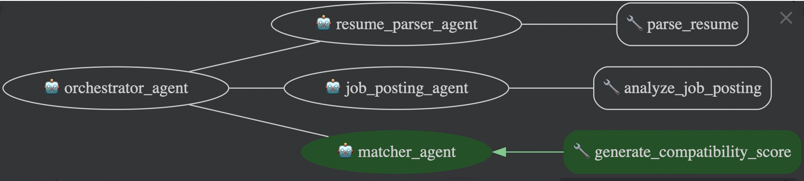

# Co-Agent-Recruitment — AI-Powered Recruitment Platform

## Executive Summary

Co-Agent-Recruitment automates the end-to-end recruitment workflow by orchestrating specialized AI agents to parse resumes, analyze job postings, and deliver data-driven match recommendations—all while safeguarding candidate privacy. Recruiters only ever see anonymized, non-PII summaries and high-level insights; our co-agents handle personal data with the utmost care.

Built on Google's Agent Development Kit (ADK), Google Genkit AI framework, and leveraging event-driven agent-to-agent communication, Co-Agent-Recruitment provides a scalable, modular architecture for streamlined and privacy-first hiring operations.


## Alpha Release
[co-agent-recruitment-v0.5.0-alpha](https://github.com/abhijitmjj/Co-Agent-Recruitment/releases/tag/v0.5.0-alpha) 


## Motivation

Hiring teams face several challenges:

- Manual extraction of unstructured resume and job posting data.
- Lack of real-time, structured insights for candidate–job alignment.
- Scalability bottlenecks when handling high volumes of applications.

Co-Agent-Recruitment Hire addresses these pain points by automating parsing, matching, and session management to accelerate and scale the recruitment process.

## Solution Overview

| Pillar                         | Description                                                          |
|--------------------------------|----------------------------------------------------------------------|
| **Next.js Frontend**           | Modern React-based UI with TypeScript, Tailwind CSS, and shadcn/ui components |
| **ADK Framework**              | Defines and configures AI agents for discrete parsing and matching tasks |
| **Google Genkit AI**           | AI framework for building and deploying AI-powered applications |
| **Agent-to-Agent Communication** | Agents coordinate via Pub/Sub events and sub-agent orchestration |
| **Core Agents**                | Resume Parser, Job Posting Parser, Matcher, and Orchestrator |
| **Authentication & Security**   | NextAuth.js with Google/GitHub OAuth, Firebase Admin SDK |
| **Cloud Infrastructure**       | Google Cloud Run, Firestore, Pub/Sub for scalable deployment |



## Architecture Overview

```text
   +----------+          +-------------+        +------------+
   | Company  |          | Resume      |        | Job Posting|
   | & Candidate|---+--->| Parser      |        | Parser     |
   +----------+   |      +-------------+        +------------+
                  |              \                /
                  |               \              /
                  |           +----------------------+      +--------+
                  +---------->| Orchestrator Agent   |----->| Matcher|
                              +----------------------+      +--------+
                                                  |
                                                  v
                                          +---------------+
                                          | UI & Reporting|
                                          +---------------+
```

## Agent Development Kit (ADK) Framework

Agents and orchestration are defined using Google’s ADK, which provides session management, callbacks, and modular sub-agent support.【F:co_agent_recruitment/agent.py†L99-L123】

The `OrchestratorAgentRunner` wraps the orchestrator for programmatic use and integrates session handling and event publishing.【F:co_agent_recruitment/agent_engine.py†L31-L44】

## Agent-to-Agent Communication (Co-Agent-Recruitment)

Agents emit and consume events via Google Cloud Pub/Sub using helper tools for robust message handling. This decouples services and enables asynchronous coordination.【F:co_agent_recruitment/tools/pubsub.py†L146-L168】【F:co_agent_recruitment/tools/pubsub.py†L171-L183】

## Core Features

Outlined in the project [blueprint](docs/blueprint.md):【F:docs/blueprint.md†L5-L9】

- **Company Interface:** Structured submission of job descriptions.
- **Candidate Interface:** Structured submission of resumes.
- **AI Matchmaking:** Orchestrator agent compares and matches profiles using Gemini via ADK.
- **Match Display:** Ranked match recommendations for both companies and candidates.
- **Privacy-First Workflow:** Recruiters only ever see anonymized summaries and high-level insights; all PII remains securely managed by our cooperative agents.

## Dataflow & Scalability Management

1. **Ingestion:** Resumes and job postings are submitted via REST or events.
2. **Parsing:** Dedicated agents transform unstructured text into JSON structures.
3. **Orchestration:** A master agent routes parsed data, invokes matching, and enriches responses with session info.
4. **Matching:** Compatibility scores are generated through a matcher agent.
5. **Emission:** Results are published to Pub/Sub, stored, and surfaced in the UI.

All components are stateless and containerized for horizontal scaling. Pub/Sub ensures backpressure management and elasticity under load.


## Event Flow


## Getting Started

### Prerequisites

- Node.js 18+ or Bun
- Python 3.9+
- Google Cloud Project with the following APIs enabled:
  - Vertex AI API
  - Firestore API
  - Cloud Run API
  - Pub/Sub API
- Firebase project setup

### Environment Setup

1. **Clone the repository:**
   ```bash
   git clone <repository-url>
   cd Co-Agent-Recruitment
   ```

2. **Copy environment templates and configure variables:**
   ```bash
   cp .env.example .env.local
   ```

3. **Configure your `.env.local` file with the following required variables:**
   ```bash
   # Authentication
   NEXTAUTH_SECRET=your_32_character_secret_key_here
   NEXTAUTH_URL=http://localhost:9002

   # Google OAuth (for user authentication)
   GOOGLE_CLIENT_ID=your_google_client_id_here
   GOOGLE_CLIENT_SECRET=your_google_client_secret_here

   # GitHub OAuth (optional)
   GITHUB_CLIENT_ID=your_github_client_id_here
   GITHUB_CLIENT_SECRET=your_github_client_secret_here

   # AI Model Configuration
   GEMINI_MODEL=gemini-2.5-flash-preview-05-20
   PROJECT_ID=your_google_cloud_project_id_here

   # Firebase Service Account (for server-side operations)
   FIREBASE_SERVICE_ACCOUNT_KEY=your_firebase_service_account_json_key

   # Feature Flags
   NEXT_PUBLIC_FEATURE_ROLE_RESTRICTION_ENABLED=false
   ```

### Installation & Development

1. **Install dependencies:**
   ```bash
   # Using npm
   npm install

   # Or using bun (recommended)
   bun install
   ```

2. **Start the Python backend (optional for full agent functionality):**
   ```bash
   # Install Python dependencies
   pip install -r requirements.txt

   # Start the backend server
   npm run dev:backend
   # or
   uvicorn co_agent_recruitment.app:app --reload
   ```

3. **Start the Next.js frontend:**
   ```bash
   npm run dev
   # or
   bun run dev
   ```

4. **Open the application:**
   - Frontend: http://localhost:9002
   - Backend API: http://localhost:8000 (if running Python backend)

### Docker Setup (Optional)

For containerized development:

```bash
# Start dependencies (Pub/Sub emulator, etc.)
docker-compose up -d

# Build and run the application
docker build -t co-agent-recruitment .
docker run -p 9002:9002 co-agent-recruitment
```

## Technology Stack

### Frontend

- **Next.js 15** - React framework with App Router
- **TypeScript** - Type-safe JavaScript
- **Tailwind CSS** - Utility-first CSS framework
- **shadcn/ui** - Modern UI component library
- **React Hook Form** - Form handling with validation
- **Zod** - Schema validation

### Backend & AI

- **Google Genkit** - AI application framework
- **Google Vertex AI** - Gemini models for AI processing
- **Python FastAPI** - Backend API for agent orchestration
- **Google ADK** - Agent Development Kit

### Authentication & Database

- **NextAuth.js** - Authentication framework
- **Firebase Auth** - User authentication
- **Firestore** - NoSQL database
- **Firebase Admin SDK** - Server-side Firebase operations

### Cloud Infrastructure

- **Google Cloud Run** - Serverless container platform
- **Google Cloud Pub/Sub** - Event messaging
- **Google Cloud Functions** - Serverless functions
- **Docker** - Containerization

### Development Tools

- **Jest** - Testing framework
- **ESLint** - Code linting
- **Prettier** - Code formatting
- **TypeScript** - Static type checking

## Available Scripts

```bash
# Development
npm run dev              # Start Next.js development server (port 9002)
npm run dev:backend      # Start Python FastAPI backend
npm run genkit:dev       # Start Genkit development server
npm run genkit:watch     # Start Genkit with file watching

# Building & Production
npm run build            # Build the Next.js application
npm run start            # Start production server
npm run typecheck        # Run TypeScript type checking

# Testing & Quality
npm run test             # Run Jest tests
npm run test:bun         # Run tests with Bun
npm run lint             # Run ESLint
```

## Debugging

A VS Code launch configuration can be added at `.vscode/launch.json`:

- **Debug TypeScript File**: runs and debugs the currently open `.ts` file using `ts-node`
- **Debug JavaScript File**: runs and debugs the currently open `.js` file with Node

Make sure to install `ts-node` as a development dependency:
```bash
npm install --save-dev ts-node
```

Select the desired configuration from the Run and Debug panel in VS Code.

## Project Structure

```
.
├── co_agent_recruitment/          # Python backend with ADK agents
│   ├── agent.py                   # Core agent definitions
│   ├── app.py                     # FastAPI application
│   ├── agent_engine.py            # Agent orchestration engine
│   ├── firestore_saver/           # Cloud Functions for data persistence
│   ├── job_posting/               # Job posting analysis agent
│   ├── matcher/                   # Compatibility matching agent
│   ├── resume_parser/             # Resume parsing agent
│   ├── tools/                     # Pub/Sub and utility tools
│   └── tests/                     # Python test suite
├── src/                           # Next.js frontend application
│   ├── app/                       # App Router pages and API routes
│   │   ├── api/                   # API endpoints
│   │   ├── candidate/             # Candidate-facing pages
│   │   ├── company/               # Company-facing pages
│   │   └── data/                  # Data analytics pages
│   ├── components/                # React components
│   │   ├── ui/                    # shadcn/ui components
│   │   └── layout/                # Layout components
│   ├── lib/                       # Utility libraries
│   │   ├── actions.ts             # Client-side actions
│   │   ├── server-actions.ts      # Server-side actions
│   │   ├── client-actions.ts      # Client API wrappers
│   │   ├── cloud-run-auth.ts      # Cloud Run authentication
│   │   ├── firebase-admin.ts      # Firebase Admin SDK
│   │   ├── firebase-client.ts     # Firebase client SDK
│   │   └── auth.ts                # NextAuth configuration
│   ├── ai/                        # Genkit AI flows
│   │   └── flows/                 # AI processing flows
│   ├── contexts/                  # React contexts
│   └── hooks/                     # Custom React hooks
├── docs/                          # Documentation and blueprints
├── public/                        # Static assets
├── Dockerfile                     # Container configuration
├── docker-compose.yaml            # Development dependencies
├── package.json                   # Node.js dependencies and scripts
├── requirements.txt               # Python dependencies
├── next.config.ts                 # Next.js configuration
├── tailwind.config.js             # Tailwind CSS configuration
└── README.md                      # This document
```

## API Endpoints

### Frontend API Routes (Next.js)

- `POST /api/auth/[...nextauth]` - NextAuth authentication
- `POST /api/auth/firebase` - Firebase token exchange
- `GET /api/data/job-postings` - Retrieve job postings
- `GET /api/data/resumes` - Retrieve candidate resumes
- `GET /api/data/compatibility-scores` - Retrieve match scores
- `POST /api/generate-compatibility` - Generate compatibility analysis
- `POST /api/publish-query` - Publish queries to backend agents

### Backend API Routes (Python FastAPI)

- `POST /orchestrator` - Main agent orchestration endpoint
- `POST /publish-event` - Pub/Sub event publishing
- `GET /health` - Health check endpoint

## Authentication & Security

The application implements a multi-layered security approach:

### User Authentication

- **NextAuth.js** with Google and GitHub OAuth providers
- **Firebase Authentication** for user management
- **JWT tokens** for session management

### API Security

- **Server-side authentication** for all Cloud Run requests
- **Google Cloud IAM** for service-to-service authentication
- **Input validation** with Zod schemas
- **CORS configuration** for cross-origin requests

### Data Privacy

- **PII protection** - Personal data handled only by backend agents
- **Anonymized summaries** - Frontend only displays non-PII insights
- **Secure data storage** - Firestore with proper access controls

## Deployment

### Google Cloud Platform
The application is designed for deployment on Google Cloud Platform:

1. **Frontend**: Deploy to Cloud Run or App Engine
2. **Backend**: Deploy Python agents to Cloud Run
3. **Database**: Use Firestore for data persistence
4. **Authentication**: Configure Firebase Auth
5. **AI Processing**: Leverage Vertex AI for Gemini models


For detailed step-by-step deployment instructions, see the [**Cloud Run Deployment Guide**](DEPLOYMENT.md).


Altenate: if you don't want to have a fully customised endpoints, you can see Vertex Agent engine deployment [**Vertex Agent Engine**](README_VERTEX_AI_DEPLOYMENT.md).


### Environment Variables for Production
Ensure all production environment variables are properly configured:

- Firebase service account credentials
- OAuth client secrets
- Cloud project configuration
- Security keys and tokens

## Monitoring & Observability

- **Application logs** via Google Cloud Logging
- **Performance monitoring** with built-in Next.js analytics
- **Error tracking** through comprehensive error handling
- **Health checks** for all services

## Contributing

Contributions are welcome! Please open an issue or pull request, and refer to our [contributing guidelines](CONTRIBUTING.md).

## Support

For questions, issues, or support, please contact us through the project repository or open an issue.

