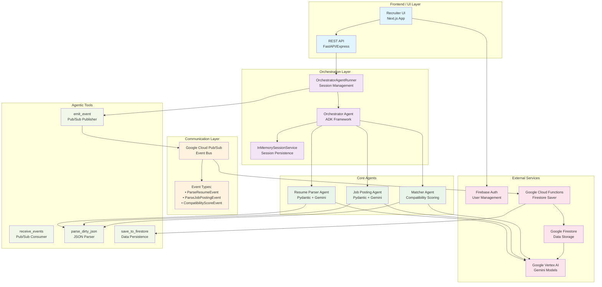
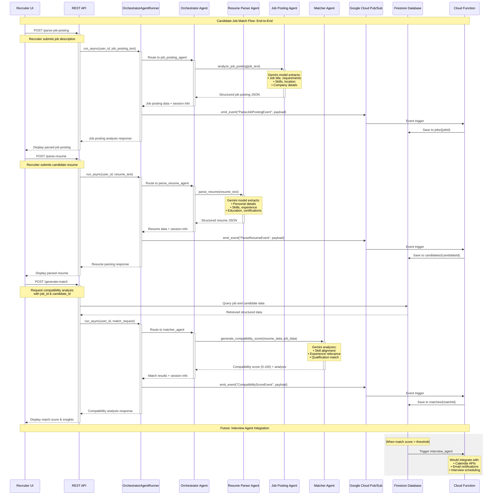

# System Design: Agent Orchestration, Tool Interfaces & End-to-End Flow

## Table of Contents
1. [High-Level Architecture](#high-level-architecture)
2. [Sequence Diagram: Candidate-Job Match Flow](#sequence-diagram-candidate-job-match-flow)
3. [Agent Specifications](#agent-specifications)
4. [Tool Interface Catalog](#tool-interface-catalog)
5. [Agent Manifest Conventions](#agent-manifest-conventions)
6. [Error Handling & Retry Mechanisms](#error-handling--retry-mechanisms)
7. [Local Development Setup](#local-development-setup)
8. [Future Hooks: Analytics & Logging](#future-hooks-analytics--logging)

---

## High-Level Architecture

The Co-Agent-Recruitment system employs a layered architecture with agent-to-agent communication facilitated by Google's Agent Development Kit (ADK) and asynchronous messaging via Google Cloud Pub/Sub.



### Architecture Layers

**Frontend/UI Layer**
- Next.js application serving the recruiter interface
- REST API endpoints handling HTTP requests and responses
- Firebase Authentication for user management

**Orchestration Layer**
- **Orchestrator Agent**: Central coordinator managing sub-agents
- **OrchestratorAgentRunner**: Wraps agent execution with session management
- **InMemorySessionService**: Maintains conversation state and user context

**Core Agents**
- **Resume Parser Agent**: Transforms unstructured resume text into structured JSON using Pydantic models
- **Job Posting Agent**: Parses job descriptions into standardized format
- **Matcher Agent**: Generates compatibility scores between candidates and positions

**Communication Layer**
- Google Cloud Pub/Sub for asynchronous, decoupled agent communication
- Event-driven architecture with standardized event types

**External Services**
- Google Vertex AI (Gemini models) for LLM processing
- Google Firestore for persistent data storage
- Google Cloud Functions for event-triggered operations

---

## Sequence Diagram: Candidate-Job Match Flow

The following sequence illustrates the end-to-end flow from job and candidate intake to match generation:



### Key Flow Steps

1. **Job Collection**: Recruiter submits job posting → parsed by `job_posting_agent` → stored in Firestore
2. **Candidate Collection**: Recruiter submits resume → parsed by `parse_resume_agent` → stored in Firestore  
3. **Match Creation**: System retrieves job + candidate data → `matcher_agent` generates compatibility score → match stored in Firestore
4. **Future Extensions**: Interview scheduling, email notifications, calendar integration

---

## Agent Specifications

### Orchestrator Agent

**File**: [`co_agent_recruitment/agent.py`](../../co_agent_recruitment/agent.py)

```python
# Configuration
name: "orchestrator_agent"
model: "gemini-2.5-flash" (configurable via MODEL_ID env var)
description: "Orchestrates the resume parsing and job posting agents. Dispatches work to the appropriate agents based on user input."
```

**Sub-agents**: `parse_resume_agent`, `job_posting_agent`, `matcher_agent`  
**Session Management**: Tracks interaction count, timestamps, conversation state  
**Output Key**: `result`

### Resume Parser Agent  

**File**: [`co_agent_recruitment/resume_parser/agent.py`](../../co_agent_recruitment/resume_parser/agent.py)

```python
# Configuration  
name: "parse_resume_agent"
model: "gemini-2.5-flash"
description: "Agent to parse resume text and transform it into a structured JSON object."
```

**Tools**: `parse_resume(resume_text: str)`  
**Output Schema**: Pydantic `Resume` model with fields for personal details, experience, education, skills  
**Output Key**: `resume_JSON`

### Job Posting Agent

**File**: [`co_agent_recruitment/job_posting/agent.py`](../../co_agent_recruitment/job_posting/agent.py)

```python
# Configuration
name: "job_posting_agent"  
model: "gemini-2.5-flash"
description: "Agent to parse job posting text and transform it into a structured JSON object."
```

**Tools**: `analyze_job_posting(job_posting: str)`  
**Output Schema**: Pydantic `JobPosting` model with company, location, requirements, skills  
**Output Key**: `job_posting_JSON`

### Matcher Agent

**File**: [`co_agent_recruitment/matcher/agent.py`](../../co_agent_recruitment/matcher/agent.py)

```python
# Configuration
name: "matcher_agent"
model: "gemini-2.5-flash" 
description: "Agent to generate a compatibility score between a resume and a job posting."
```

**Tools**: `generate_compatibility_score(resume_data, job_posting_data)`  
**Output Schema**: Pydantic `CompatibilityScore` model with score (0-100), summary, matching/missing skills  
**Output Key**: `matcher_output`

---

## Tool Interface Catalog

| Tool | Parameters | Returns | Used by | Notes |
|------|------------|---------|---------|-------|
| `emit_event` | `name: str`, `payload: Dict` | `message_id: str` | OrchestratorAgentRunner | Publishes events to Google Cloud Pub/Sub |
| `receive_events` | `max_messages: int = 5`, `timeout: int = 5` | `List[Dict]` | Testing/Debugging | Pulls events from Pub/Sub subscription |
| `parse_dirty_json` | `text_blob: str` | `Union[Dict, List, None]` | All agents | Robust JSON parsing with error handling |
| `parse_resume` | `resume_text: str` | `Dict[str, Any]` | Resume Parser Agent | Transforms resume text to structured JSON |
| `analyze_job_posting` | `job_posting: str` | `Dict[str, Any]` | Job Posting Agent | Transforms job posting to structured JSON |
| `generate_compatibility_score` | `resume_data: Dict`, `job_posting_data: Dict` | `Dict[str, Any]` | Matcher Agent | Generates compatibility analysis |
| `save_resume_to_firestore_v2` | `cloud_event: CloudEvent` | `None` | Cloud Function | Event-triggered Firestore persistence |

### Tool Details

**emit_event**
- **Purpose**: Publish structured events to Google Cloud Pub/Sub for asynchronous processing
- **Event Types**: `ParseResumeEvent`, `ParseJobPostingEvent`, `CompatibilityScoreEvent`
- **Error Handling**: Async future wrapping with timeout handling

**parse_dirty_json**  
- **Purpose**: Robust JSON parsing that handles markdown code blocks, single quotes, and malformed JSON
- **Algorithm**: Finds JSON boundaries `{...}` or `[...]`, uses `dirtyjson` library for lenient parsing
- **Fallback**: Returns `None` on parsing failure with detailed logging

**Agent Tool Functions**
- All agent tools follow consistent pattern: input validation → LLM processing → Pydantic schema validation → session info attachment
- **Error Handling**: ValidationError and general Exception catching with structured error responses
- **Session Integration**: All responses include `session_info` metadata with timestamps and operation status

---

## Agent Manifest Conventions

While the system doesn't use YAML manifest files, agents follow consistent Python-based configuration patterns:

### Agent Configuration Structure
```python
def create_[agent_name]_agent() -> Agent:
    return Agent(
        name="[agent_name]",
        model=get_model_name(),  # Environment-configurable
        description="[Clear description of agent purpose]",
        instruction="[Detailed system prompt for agent behavior]",
        tools=[list_of_tool_functions],
        output_key="[standardized_output_key]",
        before_agent_callback=[optional_before_callback],
        after_agent_callback=[optional_after_callback],
    )
```

### Callback Conventions
- **Before Callbacks**: Session state initialization, operation timing, user context setup
- **After Callbacks**: Session state updates, completion status, operation logging
- **State Management**: Consistent state keys across agents (`start_time`, `end_time`, `operation_type`, `interaction_count`)

### Tool Registration
- Tools are registered as Python functions with type hints
- Pydantic models define input/output schemas
- Error handling follows consistent exception catching patterns
- Session information is injected automatically via callback context

### Environment Configuration
```python
# Standard environment variables
MODEL_ID="gemini-2.5-flash"  # LLM model selection
PROJECT_ID="your-gcp-project"  # Google Cloud project
TOPIC_ID="co-agent-recruitment-events"  # Pub/Sub topic
SUB_ID="co-agent-recruitment-subscription"  # Pub/Sub subscription  
```

---

## Error Handling & Retry Mechanisms

### Agent-Level Error Handling

**Resume Parser Agent** ([`co_agent_recruitment/resume_parser/agent.py`](../../co_agent_recruitment/resume_parser/agent.py))
```python
try:
    result = await agent.run(sanitized_input, output_type=Resume)
    return result.output.model_dump(exclude_none=True)
except ValidationError as e:
    # Structured error response with detailed field validation errors
    return {"error": "validation_failed", "details": format_validation_errors(e)}
except Exception as e:
    # General exception handling with logging
    logger.error(f"Failed to parse resume: {e}", exc_info=True)
    raise Exception("Failed to parse resume") from e
```

**Pattern Applied Across Agents**:
- Pydantic `ValidationError` handling for schema violations
- General `Exception` catching for unexpected errors  
- Structured error responses with `operation_status` field
- Comprehensive logging with `exc_info=True` for stack traces

### Tool-Level Error Handling

**parse_dirty_json** ([`co_agent_recruitment/tools/pubsub.py`](../../co_agent_recruitment/tools/pubsub.py))
```python
try:
    parsed_data = dirtyjson.loads(potential_json)
    return json.loads(json.dumps(parsed_data))  # Normalize to standard JSON
except dirtyjson.Error as e:
    logger.error(f"dirtyjson failed to parse: {e}")
    return None
except Exception as e:
    logger.error(f"Unexpected parsing error: {e}")
    return None
```

### Session Management Error Handling

**OrchestratorAgentRunner** ([`co_agent_recruitment/agent_engine.py`](../../co_agent_recruitment/agent_engine.py))
```python
try:
    # Agent execution logic
    async for event in self.runner.run_async(...):
        # Process events
except Exception as e:
    logger.error(f"Agent execution error: {e}", exc_info=True)
    return f"An error occurred: {e}"
```

### Retry Mechanisms

**Current State**: No explicit retry wrapper implemented  
**Recommendation**: Implement exponential backoff wrapper in `utils/retry.py`

```python
# Future implementation suggestion
@retry_with_exponential_backoff(max_retries=3, base_delay=1.0)
async def resilient_agent_call(agent, input_data):
    return await agent.run(input_data)
```

### Failure Modes & Recovery

| Failure Mode | Current Handling | Recovery Mechanism |
|--------------|------------------|-------------------|
| LLM API Rate Limits | Exception logged, error returned | **TODO**: Implement exponential backoff |
| Pydantic Validation Failure | Structured error response | Graceful degradation with partial data |
| Pub/Sub Message Delivery Failure | Google Cloud handles retries | Built-in Pub/Sub retry policies |
| Firestore Connection Issues | Exception raised in Cloud Function | Cloud Functions automatic retry |
| JSON Parsing Errors | Returns `None`, logs error | Uses `dirtyjson` for lenient parsing |
| Missing Environment Variables | Falls back to defaults | Configuration validation on startup |

---

## Local Development Setup

### Prerequisites
- Python 3.11+
- Node.js 18+
- Google Cloud CLI
- Firebase CLI

### Environment Setup

1. **Clone Repository**
   ```bash
   git clone https://github.com/abhijitmjj/Co-Agent-Recruitment.git
   cd Co-Agent-Recruitment
   ```

2. **Backend Setup**
   ```bash
   # Install Python dependencies
   pip install -r requirements.txt  # Or use uv/poetry based on project setup
   
   # Environment variables
   cp .env.example .env
   # Configure MODEL_ID, PROJECT_ID, TOPIC_ID, SUB_ID
   ```

3. **Frontend Setup**
   ```bash
   # Install Node.js dependencies
   npm install
   
   # Start development server
   npm run dev  # Runs on port 9002
   ```

4. **Backend API Server**
   ```bash
   # Start FastAPI backend
   npm run dev:backend  # uvicorn co_agent_recruitment.app:app --reload
   ```

### Local Services

**Firestore Emulator**
```bash
# Start Firebase emulator suite
firebase emulators:start --only firestore
# Emulator runs on http://localhost:8080
```

**Pub/Sub Emulator**
```bash
# Install and start Pub/Sub emulator
gcloud components install pubsub-emulator
gcloud beta emulators pubsub start --project=your-project-id
```

**ngrok for Webhooks** (if testing external webhook integrations)
```bash
# Expose local development server
ngrok http 8000  # Expose backend API
ngrok http 9002  # Expose frontend
```

### Make Targets

Based on the project structure, suggested `Makefile` targets:

```makefile
.PHONY: install dev test build lint

install:
	pip install -r requirements.txt
	npm install

dev:
	# Start all development services
	docker-compose up -d  # Firebase emulators
	npm run dev:backend &
	npm run dev

test:
	npm run test
	python -m pytest co_agent_recruitment/tests/

build:
	npm run build
	docker build -t co-agent-recruitment .

lint:
	npm run lint
	pylint co_agent_recruitment/
	black co_agent_recruitment/
```

### Testing

**Frontend Tests**
```bash
npm run test        # Jest tests
npm run test:bun    # Bun tests
```

**Backend Tests**  
```bash
python -m pytest co_agent_recruitment/tests/
# Test files include:
# - test_agents_json_output.py
# - test_security.py  
# - test_session.py
```

### Configuration Files

- **Docker**: `compose.yaml` for local service dependencies
- **Firebase**: `firebase.json` for emulator configuration
- **Next.js**: `next.config.ts` for frontend build settings
- **TypeScript**: `tsconfig.json` for type checking

---

## Future Hooks: Analytics & Logging

### Current Logging Infrastructure

**Structured Logging** ([`co_agent_recruitment/callbacks.py`](../../co_agent_recruitment/callbacks.py))
```python
logging.basicConfig(
    level=logging.INFO,
    format="%(asctime)s - %(name)s - [%(levelname)s] - %(message)s",
    handlers=[logging.StreamHandler()],
)
```

**Session-Level Tracking**
- Interaction counts and timing
- User context and conversation flow
- Operation status and completion tracking

### Proposed Analytics Extensions

#### 1. Agent Performance Metrics
```python
# Future: co_agent_recruitment/analytics/metrics.py
class AgentMetrics:
    def track_agent_performance(self, agent_name: str, duration: float, 
                               success: bool, token_usage: int):
        # Track agent execution metrics
        
    def track_user_journey(self, user_id: str, session_id: str, 
                          actions: List[str], outcomes: Dict):
        # Track user interaction patterns
```

#### 2. Business Intelligence Integration
```python
# Future: co_agent_recruitment/analytics/bi_connector.py
async def export_match_analytics():
    """Export match success rates, agent performance, user patterns"""
    # Connect to BigQuery/Data Warehouse
    # Aggregate agent performance data
    # Generate business intelligence reports
```

#### 3. Real-time Monitoring Hooks
```python  
# Future: co_agent_recruitment/monitoring/hooks.py
@monitor_agent_calls
async def agent_with_monitoring(agent_func):
    """Decorator to add monitoring to agent calls"""
    # Track latency, success rate, error patterns
    # Send metrics to Cloud Monitoring/Datadog
    # Alert on anomalies
```

#### 4. Audit Trail Enhancement
```python
# Future: co_agent_recruitment/audit/trail.py
class AuditLogger:
    def log_data_access(self, user_id: str, resource: str, action: str):
        """Log all data access for compliance"""
        
    def log_agent_decisions(self, agent_name: str, input_hash: str, 
                           output_summary: str, confidence: float):
        """Log agent decision-making for explainability"""
```

### Integration Points

**Event-Driven Analytics**
- Extend existing Pub/Sub events with analytics metadata
- Create dedicated analytics topic for business intelligence
- Stream events to BigQuery for data warehousing

**Session Enhancement**  
- Add user behavior tracking to session state
- Implement conversion funnel analytics
- Track agent handoff patterns and success rates

**External Integrations**
- Google Analytics for user interface interactions
- Cloud Monitoring for system health metrics
- Custom dashboards for recruitment team insights

---

## Conclusion

This system design provides a comprehensive view of the Co-Agent-Recruitment platform's architecture, emphasizing the agent-to-agent communication patterns, robust error handling, and extensible design for future enhancements. The modular approach with clear separation of concerns enables both horizontal scaling and feature evolution while maintaining system reliability and observability.